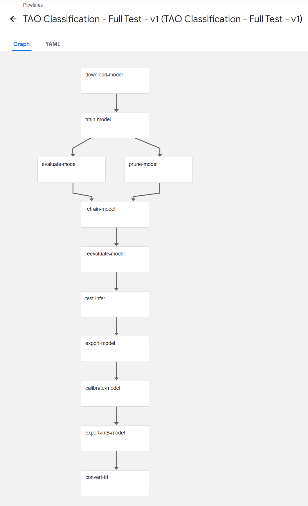

# Kubeflow TAO (3.0) Pipeline Example

## Overview

NVIDIA released sample code demonstrating how to build a Kubeflow pipeline for a NVIDIA TLT workflow (transfer learning).  The sample was built for version 1.0 of TLT.  The goal was to demonstrate how to build the pipeline and the sample showed how using Transfer Learning with a Object Detection pipeline.  The process to build this pipeline is very manual and the example exposed a limited setup of TLT commands necessary.  It didn't expose all possible operators or parameters that could be passed to calls.  Again - a simple blue print on how someone might build their own pipeline.

Just recently, NVIDIA has release TAO (version 3.0) which is the next version of TLT.  Several customers have asked about building pipelines for TAO in Kubeflow.  This repository is an example of building a "Classification" pipeline based on the [Classification Notebook Example](https://docs.nvidia.com/tao/tao-toolkit/text/tao_toolkit_quick_start_guide.html#cv-samples).  

This is not intended to be a full project, but rather a sample pipeline conversion that you can use as a basis to create your own pipelines. 

## General Guidance

My general guidance for this example is to first build a functioning workflow from the command line and then use that as a basis for creating your own pipeline script.

## Pipeline Creation Process

Check out the "docs" page where I walk through the steps.

## Key Issues and Improvements

Here are some of the issues I dealt with:
- This pipeline assumes that there is a "volume" (could be K8s PV, NFS, etc) mounted that contains all of the models, training data, and newly created models.  For this example, I used "/mnt/workspace" as the mount point for my key files.  I had this pre-mounted in my environment - you'll have to find a strategy that works for your environment.  (I didn't see an easy way to do it in the pipeline and left it as a future exercise)
- Each of the TAO models (classification, object detection, ...) have their on data file formats and conversions required.  You'll have to review the [documentation](https://docs.nvidia.com/tao/tao-toolkit/text/data_annotation_format.html) and make the appropriate changes for different types of models.
- Each of the TAO models has it's own specification files and requirements.  This is a large part of the configuration for the training and evaluation.  You'll need to create your own versions for other models.
- In general, because of all the variations of files and configuration, there is not a clean way to create one interface.  So, realistically, you'll want to build different pipelines for different models.
- In general, while you could pass many parameters through the Kubeflow Pipeline Create Run interface, it only presents basic text input boxes so you wouldn't want to have too many on the screen.

Some improvements:

- Someone with a deeper understanding of Kubeflow pipelines could probably suggest some improvements.
  - I look at the individual component log files to review issues.
  - There is no "run output" at the pipeline level.
- Not sure how well "experiment" output (accuracy, etc) is reported back.

## Example of Pipeline

 
