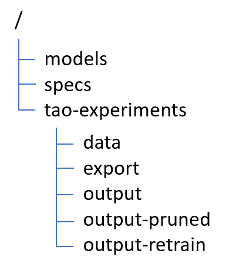
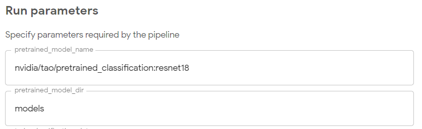

# Documentation
Here are the basic steps to create a new pipeline.

## Pipeline Creation Process

There are several key components used in building a pipeline:
- **Component Container(s)**: These are containers with applications that are run by the pipeline.  For my entire pipeline, I used the standard TAO NGC container as I needed to run TAO commands against my models and data files.
- **Pipeline Python Files**: The files are the ones you'll create to build your pipeline.
- **Pipeline YAML File**: This file is created by the Python files and is uploaded to Kubeflow to add the pipeline.

For the "Classification Example" here, there are 2 key files used to build the pipeline:
- **tao_iva_classification_pipeline.py**: This file defines the "parameters" that are input to the pipeline and the DAG for the workflow (that calls operators in the 'ops' file)
- **tao_iva_classification_ops.py**: This file defines all the operators that are called from the DAG.  The operators define all the TAO command line calls and parameters.

When the **tao_iva_classification_pipeline.py** file is run, it will create the "YAML" file that is uploaded into Kubeflow.  By default, this file is a tar'ed and compressed image - **tao_iva_classification_pipeline.yaml.tar.gz**.

The actual steps for creating are:
1. You'll need an environment with Python3
2. You'll need to install the Kubeflow Pipelines SDK: `pip3 install kfp --upgrade`
3. Edit the "pipeline.py" file to build out the graph for the sequence of commands you wish to run.  You may need to update the "ops.py" file as it only exposes a subset of all possible TAO operations and passed parameters.
4. Run the "pipeline.py" file to create the "pipeline.yaml" file: `python3 tao_iva_classification_pipeline.py`
5. Take the generated YAML file and upload it into Kubeflow.  You'll go to the "Pipelines" section and choose "Add Pipeline".
 
## Steps I went through
### Step 1: Define standard directory structure.

This example uses the following directory structure that will be mounted at /mnt/workspace:



Here's the use of each directory:
- models: Pre-trained NGC models are downloaded here
- specs: You'll need to create appropriate TAO specification files for your training and evaluation.  
- tao-experiments: All experiment information will be stored here.
  - data: All of your data for fine tuning the model goes here.  Each model has it's format defined at [documentation](https://docs.nvidia.com/tao/tao-toolkit/text/data_annotation_format.html#image-classification-format)
  - export: All output models are stored here
  - output: Stores initial training epoch model weights and class file
  - output-pruned: Stores files from pruning
  - output-retrain: Stores epoch model weights and class file from re-training after pruning

### Step 2: Document commands needed for pipeline

Based on the Classification Jupyter Example, here were the commands I needed:
- Download appropriate pre-trained model
  - ```ngc registry model download-version nvidia/tao/pretrained_classification:resnet18 --dest /mnt/workspace/models```
- Run initial training
  - ```classification train -e /mnt/workspace/specs/classification_spec.cfg -r /mnt/workspace/tao-experiments/output --gpus <num_gpus> -k <your_key>```
- Evaluate initial model and prune model (can be run in parallel)
  - ```classification evaluate -e /mnt/workspace/specs/classification_spec.cfg -k <your_key>```
  - ```classification prune -m /mnt/workspace/tao-experiments/output/weights/resnet_20.tlt -o /mnt/workspace/tao-experiments/output/resnet-pruned/resnet18_nopool_bn_pruned.tlt -eq union -pth 0.6 -k <your_key>```
- Retrain pruned model
  - ```classification train -e /mnt/workspace/specs/classification_retrain_spec.cfg -r /mnt/workspace/tao-experiments/output_retrain -k <your_key>```
- Evaluate retrained, pruned model
  - ```classification evaluate -e /mnt/workspace/specs/classification_retrain_spec.cfg -k <your_key>```
- Test inference
  - ```classification inference -e /mnt/workspace/specs/classification_retrain_spec.cfg -m /mnt/workspace/tao-experiments/output_retrain/weights/resnet_20.tlt -b 32 -d /mnt/workspace/tao-experiments/data/split/test/person -cm /mnt/workspace/tao-experiments/output_retrain/classmap.json -k <your_key>```
- *** There are more commands that can be found in the notebook, but this is a good example ***

### Step 3: Build Custom Component Container

Components in the Kubeflow pipeline need a container defined to provide the applications that are used.  We will be using the standard TAO container
(nvcr.io/nvidia/tao/tao-toolkit-tf:v3.21.08-py3) as a basis for a custom container we will build.  Most of the TAO applications already reside in this container,
but we will be adding the NGC CLI to this container so our custom container have both TAO and NGC CLI available.  We will save this container away for use
by Kubeflow when running the pipeline.  I have included a Dockerfile to assist in building this container [Dockerfile](../docker/Dockerfile).

To build this container, you can use the included [build.sh](../docker/run.sh) script.

```buildoutcfg
(env) ward@dgx:~/projects/Kubeflow-TAO-Pipeline/docker$ ./build.sh
Sending build context to Docker daemon  5.632kB
Step 1/12 : FROM nvcr.io/nvidia/tao/tao-toolkit-tf:v3.21.08-py3
 ---> 8672180cbf38
Step 2/12 : RUN apt update
 ---> Using cache
 ---> 2f4f45f50c21
Step 3/12 : RUN pip3 install nvidia-pyindex
 ---> Using cache
 ---> 9749b1098070
Step 4/12 : RUN pip3 install nvidia-tao
 ---> Using cache
 ---> 1bf1dfe20527
Step 5/12 : RUN pip3 install kfp
 ---> Using cache
 ---> 527fa73dc8af
Step 6/12 : RUN mkdir /mnt/workspace
 ---> Using cache
 ---> 430436e08e29
Step 7/12 : WORKDIR /opt/
 ---> Using cache
 ---> dc737ea50d05
Step 8/12 : RUN mkdir ngccli
 ---> Using cache
 ---> 851edb5fa45c
Step 9/12 : WORKDIR /opt/ngccli
 ---> Using cache
 ---> f604b067d27f
Step 10/12 : RUN wget https://ngc.nvidia.com/downloads/ngccli_reg_linux.zip
 ---> Using cache
 ---> 9c7650c76ecc
Step 11/12 : RUN unzip ngccli_reg_linux.zip
 ---> Using cache
 ---> 4743b9a6bbf4
Step 12/12 : WORKDIR /workspace/
 ---> Using cache
 ---> c5e322cea4f4
Successfully built c5e322cea4f4
Successfully tagged tao-toolkit-tf-kf:3.21.08
```

If you decide to change the name of the custom Docker container, you will need to update the [tao_iva_classification_ops.py](../tao_iva_classification_ops.py) 
script so the pipeline loads the correct container.

### Step 4: Create pipeline and appropriate ops

Here, we'll edit the two key pipeline files to create a pipeline.  Let's take the first 2 steps as an example:

**Download appropriate pre-trained model**

First, we'll start in the **tao_iva_classification_ops.py** file.  You'll see there is a pre-define function to download a model:
```
class TAOPullOp(dsl.ContainerOp):
  def __init__(self, name, tao_mount_dir, model_dir, model_name):
    super(TAOPullOp, self).__init__(
      name=name,
      image=__TAO_CONTAINER_VERSION__,
      command=['/opt/ngccli/ngc'],
      arguments=['registry',
                 'model',
                 'download-version',
                 model_name,
                 '--dest', '%s/%s' % (tao_mount_dir, model_dir)
      ],
      file_outputs={}
      )
```

You can see by looking at the function that it is running the "ngc" command with some arguments.  When I converted the TLT code to get this running,
there were cases where the pre-existing call met my needs and other cases where I need to create additional operators because I needed
additional parameters passed (in which case, you could use the original operator as a template).

Next, we'll start adding the components to the **tao_iva_classification_pipeline.py** file.

You see in the beginning a set of defined parameters.  These are passed into the pipeline through the Kubeflow Pipeline execution
screen.  Any parameters that you want to specify for the run can be included here.  (For parameters that don't change, you can
just add them as constants into this Python script).

```
def taoPipeline(
  pretrained_model_name: str ="nvidia/tao/pretrained_classification:resnet18",
  pretrained_model_dir: str ="models",
  tao_mount_dir: str ="/mnt/workspace", # directory where model/data volume mounted
 ...
```

Since we want to pass the desired pretrained model and location to store the model when downloading, we added those parameters.
When you go to "Create run" under Pipelines, you'll see the parameters listed:



Then, we need to start building the DAG which defines the pipeline.  We'll add the "TAOPullOp" to download our model with the appropriate
parameters.

```
  op_dict['tao_pull'] = tao_iva_ops.TAOPullOp(
                          "download-model", tao_mount_dir, pretrained_model_dir, pretrained_model_name)
```
The string 'tao_pull' is used to identify components in the dict.  And the string "download-model" is displayed in the Kubeflow interface as
as the name of the step in the pipeline.

**Run initial training**

Just like before, we'll go to the **tao_iva_classification_ops.py** file.  You'll see there is a pre-define function to train a model:
```buildoutcfg
class TAOTrainClassificationOp(dsl.ContainerOp):
  def __init__(self, name, tao_mount_dir, api_key, results_dir, spec_file, num_gpus):
    super(TAOTrainClassificationOp, self).__init__(
      name=name,
      image=__TAO_CONTAINER_VERSION__,
      command=['classification'],
      arguments=[
        'train',
        '--gpus', num_gpus,
        '-k', api_key,
        '-e', '%s/%s' % (tao_mount_dir, spec_file),
        '-r', '%s/%s' % (tao_mount_dir, results_dir)
      ],
      file_outputs={}
      )
    name=name
```
We'll use this operator to call "classification train" from the pipeline.

Next, we'll add the component onto the pipeline in **tao_iva_classification_pipeline.py** file.  First, we added parameters necessary to the
training to the parameters list:

```buildoutcfg
def taoPipeline(
 ...
  train_classification_data: str = "tao-experiments/data",
  train_classification_spec: str = "specs/classification_spec.cfg",
  train_classification_output: str = "tao-experiments/output",
  train_num_gpus: str = "1",
 ...
```

Then, we add the new component onto the DAG for the pipeline.  We'll add the component and then we'll specify that this particular component 
comes after the first one that we started the pipeline with.

```buildoutcfg
  op_dict['tao_train'] = tao_iva_ops.TAOTrainClassificationOp(
                          "train-model", tao_mount_dir, api_key, train_classification_output,
                          train_classification_spec, train_num_gpus)
  op_dict['tao_train'].after(op_dict['tao_pull'])
```
You'll see that we specify in the dict that 'tao-train' comes after 'tao-pull'.  The KPF package which builds the final pipeline YAML file uses this
information to build the appropriate graph.

**Finalizing the pipeline**

Two last pieces of code are in our **tao_iva_classification_pipeline.py** file add the external storage access and then make calls to build the pipeline.

This piece of code adds our persistent volume mount to all of the operators so that our "shared" storage volume is available to all components:
```buildoutcfg
  for name, container_op in op_dict.items():
    container_op.add_volume(k8s_client.V1Volume(
      host_path=k8s_client.V1HostPathVolumeSource(path=tao_mount_dir.__str__()),
      name=persistent_volume_name))
    container_op.add_volume_mount(k8s_client.V1VolumeMount(
      mount_path=tao_mount_dir.__str__(),
      name=persistent_volume_name))
```
and finally, we make the call to build and output the pipeline using the KPF calls:

```buildoutcfg
if __name__ == '__main__':
  import kfp.compiler as compiler
  compiler.Compiler().compile(taoPipeline, __file__ + '.tar.gz')
```

### Step 5: Running the pipeline build

Now that we've updated the pipeline Python files, we can build the pipeline file **tao_iva_ops_pipeline.py.tar.gz**.

I have included a simple run.sh script in the docker directory that starts the custom docker container we built to support this pipeline. 
You can use any python3 environment that has kfp installed.
```buildoutcfg
(env) ward@dgx:~/projects/Kubeflow-TAO-Pipeline$ docker/run.sh
root@315cc487bba9:/workspace# cd /home/ward/projects/Kubeflow-TAO-Pipeline/
root@315cc487bba9:/home/ward/projects/Kubeflow-TAO-Pipeline# python3 tao_iva_classification_pipeline.py
/usr/local/lib/python3.6/dist-packages/kfp/dsl/_container_op.py:1264: FutureWarning: Please create reusable components instead of constructing ContainerOp instances directly. Reusable components are shareable, portable and have compatibility and support guarantees. Please see the documentation: https://www.kubeflow.org/docs/pipelines/sdk/component-development/#writing-your-component-definition-file The components can be created manually (or, in case of python, using kfp.components.create_component_from_func or func_to_container_op) and then loaded using kfp.components.load_component_from_file, load_component_from_uri or load_component_from_text: https://kubeflow-pipelines.readthedocs.io/en/stable/source/kfp.components.html#kfp.components.load_component_from_file
  category=FutureWarning,
root@315cc487bba9:/home/ward/projects/Kubeflow-TAO-Pipeline# ls *.gz
tao_iva_classification_pipeline.py.tar.gz
root@315cc487bba9:/home/ward/projects/Kubeflow-TAO-Pipeline#
```

