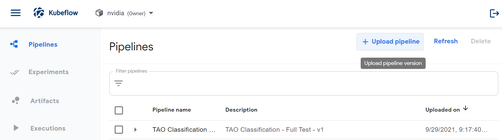
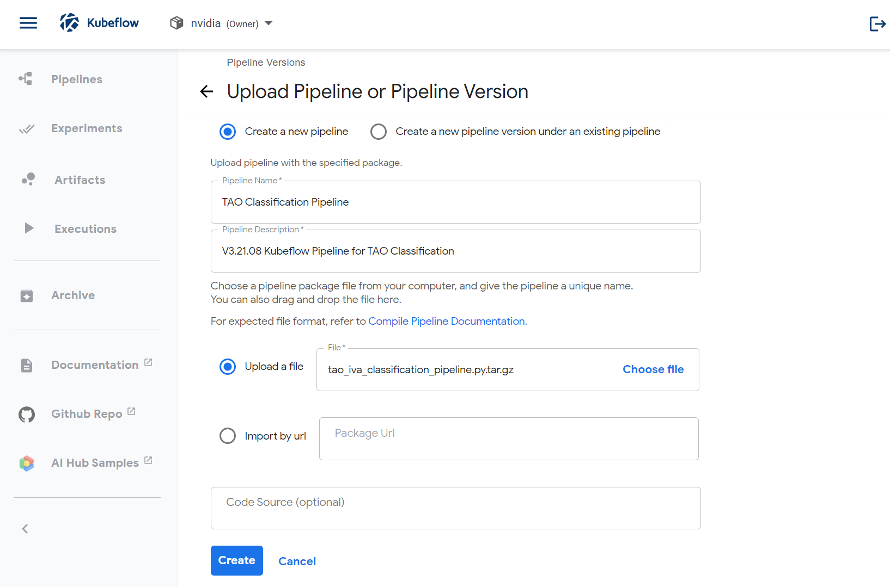
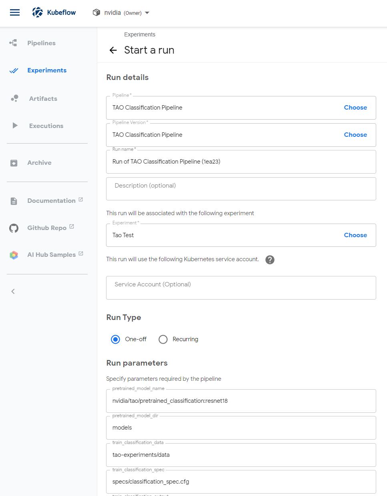
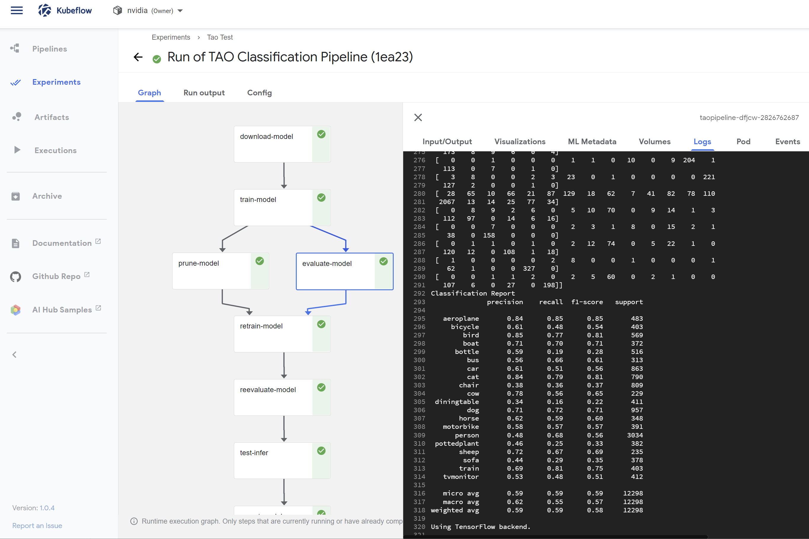

# Running a Pipeline

For my testing, I used the Kubeflow Web Interface to upload the pipeline, create experiments, and run my tests.

## Step 1: Load pipeline YAML file into Kubeflow

Once you have created the **tao_iva_classification_pipeline.py** file, you'll want to load it into Kubeflow so you can use it.  To do this, you'll
want to go to "Pipelines" and select "+ Upload Pipeline"

You be presented with a screen to define the pipeline where you provide a pipeline name, description, and the pipeline file you created.

## Step 2: Run the pipeline

Once the pipeline is loaded, you can run it by selectng "Create Run" from the Pipeline screen.  Here, you will be given a screen
to define an experiment to associate the pipeline with (you'll have to create one), can specify parameters passed to the pipeline, 
and click Start (at the bottom).

Once it's running, you can click on the run and watch its status by clicking on the job.  To check the status, you can
click on individual components and click on the log tab to view that status and error messages that might have come out.

